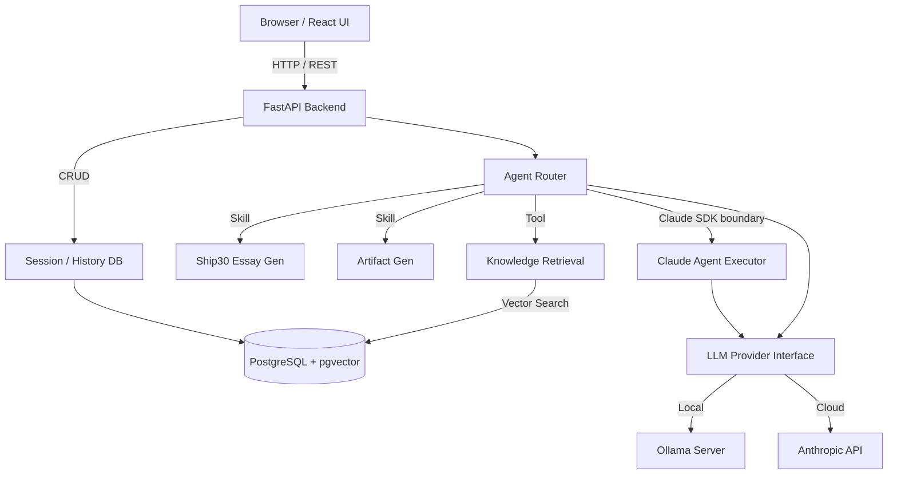

# System Architecture

## System Diagram

## Frontend Architecture
- **Framework:** React 18 + Vite + TypeScript.
- **State Management:** Custom React Hooks (`useChat`, `useSessions`, `useHealth`).
- **Styling:** Vanilla CSS with CSS Variables. Strict editorial design system (Inter + Newsreader). No Tailwind.
- **Artifact Security:** HTML artifacts rendered via `<iframe sandbox="allow-scripts">`.

## Backend Architecture
- **Framework:** FastAPI.
- **Dependency Injection:** Database sessions and LLM providers injected into routes.
- **Error Handling:** Centralized `AppError` exception handling returning structured JSON.
- **Logging:** `structlog` for structured, JSON-formatted observability.
- **Agent SDK boundary:** `backend/app/agent/execution.py` exposes the agent
    execution boundary. Claude selections use `ClaudeAgentExecutor`, backed by
    the official `anthropic.AsyncAnthropic` SDK; Ollama selections use the
    provider executor fallback without changing local behavior.

## Database Lifecycle and Migrations
- **Provisioning:** Docker Compose owns the PostgreSQL + pgvector container
    and persistent `pgdata` volume. The backend container waits for the database
    healthcheck before starting.
- **Schema:** `backend/alembic/versions/0001_initial_schema.py` is the initial
    versioned schema for the six SQLAlchemy models. Run
    `python -m alembic -c backend/alembic.ini upgrade head` for fresh or migrated
    environments.
- **Startup resilience:** `init_database()` still verifies the vector extension
    and creates missing tables during local startup; it does not replace
    versioned migrations for schema changes.

## RAG Flow
1. **Ingestion:** `.md` files → YAML frontmatter parsed → Cleaned → Chunked (512 words, 64 overlap) → Embedded (`all-MiniLM-L6-v2`) → Inserted to PostgreSQL.
2. **Retrieval:** User query → Embedded → pgvector Cosine Similarity (`<=>`) → Top 6 chunks retrieved.
3. **Context Construction:** Chunks formatted into a strict system prompt enforcing source grounding.

## LLM Provider Abstraction
An abstract `LLMProvider` class requires `generate()` and `health_check()`.
- `OllamaProvider`: Uses `httpx` to POST to `localhost:11434/api/chat`.
- `AnthropicProvider`: Uses the official `anthropic` Python SDK.
- Switching is controlled purely by `LLM_PROVIDER` in `.env`.

## Deployment Architecture
### Local
- **Docker Compose:** Runs PostgreSQL (pgvector).
- **Host:** Runs FastAPI, Vite, and Ollama.

### Cloud (Vercel + Supabase)
- **Vercel Serverless:** `api/index.py` mounts the FastAPI app for serverless execution.
- **Supabase:** Hosted PostgreSQL with pgvector.
- **Anthropic:** Cloud LLM generation.

## Observability
All chat requests generate a `ChatMetadata` object capturing:
- `retrieval_count`
- `latency_ms`
- `provider`
- `model`
These are stored alongside the messages in the DB.
